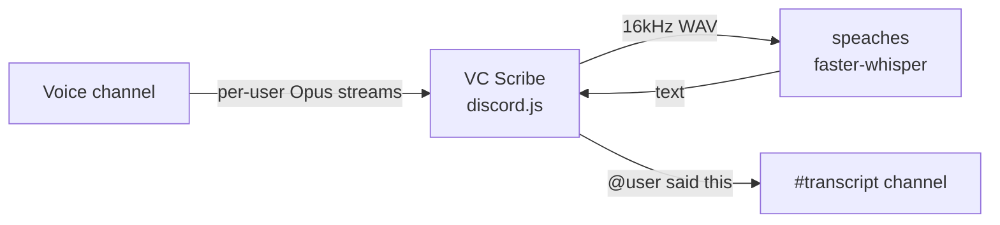

# VC Scribe

A **private, self-hosted Discord bot** that sits in a voice channel 24/7 and writes down everything that happens:

- 🎙️ **Speech → text** — every spoken sentence becomes a message: `@Speaker what they said`
- ➡️ **Join / leave log** — `@User joined the call` / `@User left the call`
- 🔇 **Deafen to pause** — server-deafen the bot and it stops transcribing; undeafen to resume
- 📌 **Assigned, not invited** — `/scribe assign` parks it in a VC until you `/scribe unassign` (it survives restarts and reconnects on its own)
- 💤 **Presence-aware** — leaves the voice channel when the last person leaves, hops back in the moment someone joins (while staying assigned)
- 🏠 **Runs entirely on your hardware** — audio never leaves your server; STT is a local Whisper model

Transcript messages render mentions (`@name`) but never ping anyone.

## How it works



Discord delivers **a separate audio stream per speaker**, so attribution is exact — no diarization guesswork. Each stream is decoded, chunked on silence, and sent to a local [speaches](https://github.com/speaches-ai/speaches) (faster-whisper) server.

## Setup

### 1. Create the Discord app (private!)

1. Go to the [Developer Portal](https://discord.com/developers/applications) → **New Application**
2. **Bot** tab:
   - **Uncheck "Public Bot"** ← this is what keeps it yours; only you can add it to servers
   - **Reset Token** and copy it
3. No privileged intents are needed.
4. Invite it with (replace `YOUR_APP_ID`):

```text
https://discord.com/api/oauth2/authorize?client_id=YOUR_APP_ID&scope=bot%20applications.commands&permissions=1051648
```

`1051648` = View Channels + Connect + Send Messages.

### 2. Run it

```bash
git clone https://github.com/tomerh2001/discord-vc-scribe.git
cd discord-vc-scribe
cp .env.example .env   # paste your DISCORD_TOKEN
docker compose up -d --build
```

First transcription downloads the Whisper model (~500 MB for `small`), so give it a minute.

<details>
<summary>Bare-metal instead of Docker</summary>

```bash
npm install
npm run build
STT_URL=http://your-stt-server:8000 node dist/index.js
```

Point `STT_URL` at any OpenAI-compatible `/v1/audio/transcriptions` endpoint
(speaches, faster-whisper-server, or even OpenAI itself).

</details>

### 3. Use it

| Action | How |
|---|---|
| Start logging | `/scribe assign voice_channel:#General log_channel:#transcript` |
| Stop | `/scribe unassign` |
| Pause / resume transcription | Right-click the bot → **Server Deafen** / undeafen |
| Move it | Drag it to another VC — it follows and keeps logging |
| Check state | `/scribe status` |

Commands require **Manage Server** permission.

> ⚠️ Kicking the bot from the VC does *not* remove it — it reconnects (that's the 24/7 part). Use `/scribe unassign`.

## Configuration

All via `.env` (see [.env.example](.env.example)):

| Variable | Default | Meaning |
|---|---|---|
| `DISCORD_TOKEN` | — | Bot token (required) |
| `STT_URL` | `http://localhost:8000` | OpenAI-compatible STT server |
| `STT_MODEL` | `Systran/faster-whisper-small` | Whisper model (`medium`/`large-v3` w/ GPU) |
| `STT_LANGUAGE` | auto-detect | Language hint, e.g. `en`, `he` |
| `ALLOWED_GUILD_IDS` | allow all | Comma-separated server IDs; bot leaves any other server |
| `SILENCE_MS` | `1200` | Pause that ends a sentence |
| `MIN_SPEECH_MS` | `600` | Discard shorter blips |
| `MAX_SEGMENT_MS` | `45000` | Flush long monologues in chunks |

## Good to know

- **Consent**: this bot records and transcribes voice. Discord's ToS expects everyone in the call to know — put it in the channel name/topic and tell your friends.
- **Voice receive** isn't officially documented by Discord, but has been stable in discord.js for years (Craig, Scripty, and friends all rely on it).
- **Hardware**: `small` on CPU keeps up with normal conversation. A GPU makes `large-v3` effortless (`:latest-cuda` image tag).

## License

[MIT](LICENSE)
