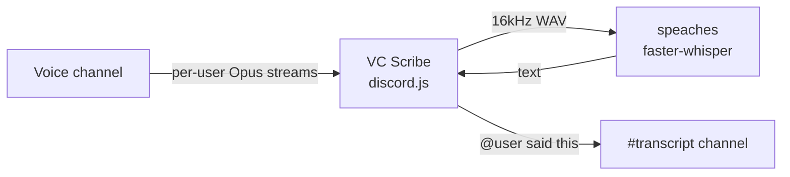

# VC Scribe

A self-hosted Discord transcription service with independent voice-to-chat assignments. Assign any accessible voice channel to a text channel, thread, or voice-channel chat. Multiple helper bots can transcribe different calls in the same server at once.

- 🎙️ **Speech → text** — every spoken sentence becomes a message: `@Speaker what they said`
- ➡️ **Join / leave log** — `@User joined the call` / `@User left the call`
- 🔇 **Deafen to pause** — server-deafen the bot and it stops transcribing; undeafen to resume
- 📌 **Persistent assignments** — each voice channel keeps its own destination across restarts. Adding another assignment leaves existing calls running.
- 💤 **Presence-aware** — leaves the voice channel when the last person leaves, hops back in the moment someone joins (while staying assigned)
- 🏠 **Runs entirely on your hardware** — audio never leaves your server; STT is a local Whisper model

Transcript messages render mentions (`@name`) but never ping anyone.

## How it works


```mermaid
flowchart LR
    VC[Voice channel] -->|per-user Opus streams| BOT[VC Scribe<br/>discord.js]
    BOT -->|16kHz WAV| STT[speaches<br/>faster-whisper]
    STT -->|text| BOT
    BOT -->|"@user said this"| LOG[#transcript channel]
```

Discord delivers **a separate audio stream per speaker**, so attribution is exact — no diarization guesswork. Each stream is decoded, chunked on silence, and sent to a local [speaches](https://github.com/speaches-ai/speaches) (faster-whisper) server.

## Setup

### 1. Create the Discord app

1. Go to the [Developer Portal](https://discord.com/developers/applications) → **New Application**
2. **Bot** tab:
   - **Uncheck "Public Bot"** ← this is what keeps it yours; only you can add it to servers
   - **Reset Token** and copy it
3. No privileged intents are needed.
4. Invite it with (replace `YOUR_APP_ID`):

```text
https://discord.com/api/oauth2/authorize?client_id=YOUR_APP_ID&scope=bot%20applications.commands&permissions=1051648
```

`1051648` = View Channels + Connect + Send Messages.

### 2. Run it

```bash
git clone https://github.com/tomerh2001/discord-vc-scribe.git
cd discord-vc-scribe
cp .env.example .env   # paste your DISCORD_TOKEN
docker compose up -d --build
```

First transcription downloads the Whisper model (~500 MB for `small`), so give it a minute.

<details>
<summary>Bare-metal instead of Docker</summary>

```bash
npm install
npm run build
STT_URL=http://your-stt-server:8000 node dist/index.js
```

Point `STT_URL` at any OpenAI-compatible `/v1/audio/transcriptions` endpoint
(speaches, faster-whisper-server, or even OpenAI itself).

</details>

### 3. Use it

| Action | How |
|---|---|
| Start logging | `/scribe assign voice_channel:#General log_channel:#transcript` |
| Stop one assignment | `/scribe unassign voice_channel:#General` |
| Pause / resume transcription | Right-click the bot → **Server Deafen** / undeafen |
| Change a destination | Repeat `/scribe assign` for that voice channel with the new log channel |
| Check all assignments and capacity | `/scribe status` |

Commands require **Manage Server** permission, checked when each command runs.
The caller must be able to view the selected channels. Each helper needs **View
Channel** and **Connect** in its assigned voice channel, plus **View Channel** and
**Send Messages** in the destination. Threads require **Send Messages in Threads**
and must be open. Private threads also require caller and helper membership,
unless they have Manage Threads. Channel overwrites still apply, including
private channels.

An assignment stays pinned to its selected voice channel. Dragging a helper
elsewhere does not change its transcript destination or start recording that
other channel. Use the commands to change assignments.

### 4. Enable simultaneous calls

Discord's [voice client supports one voice channel per server](https://github.com/discordjs/guide/blob/main/guide/voice/voice-connections.md).
Use a distinct bot application for each simultaneous assignment in that server.
A helper can also serve one assignment in each of several servers.

1. Create and invite the additional bot applications using the permissions above.
2. Keep the primary token in `DISCORD_TOKEN`. Put the helper tokens in
   `DISCORD_WORKER_TOKENS` as a JSON array, for example `["helper-token-1","helper-token-2"]`.
3. Restart the service. Run `/scribe assign` once for each voice-to-chat pair.

Only the primary bot registers commands. It allocates an available helper to
each assignment. An empty voice channel keeps its helper reserved so every
assignment can become active at once. `/scribe status` shows available capacity
and each assignment's worker and state. If capacity or permissions are missing,
the new assignment fails with an explanation and existing assignments continue.

Two voice channels may share a destination. Their transcript lines include the
source voice channel so simultaneous conversations stay distinguishable.
A voice channel has one destination; assigning it again updates that destination.
Failed startup assignments remain saved and visible in status. Repair access or
worker configuration, then reassign the channel or restart to retry.

> ⚠️ Kicking the bot from the VC does *not* remove it — it reconnects (that's the 24/7 part). Use `/scribe unassign voice_channel:#General`.

## Configuration

All via `.env` (see [.env.example](.env.example)):

| Variable | Default | Meaning |
|---|---|---|
| `DISCORD_TOKEN` | — | Primary bot token (required) |
| `DISCORD_WORKER_TOKENS` | `[]` | JSON array of distinct helper bot tokens; one extra assignment per server per helper |
| `STT_URL` | `http://localhost:8000` | OpenAI-compatible STT server |
| `STT_MODEL` | `Systran/faster-whisper-small` | Whisper model (`medium`/`large-v3` w/ GPU) |
| `STT_LANGUAGE` | auto-detect | Language hint, e.g. `en`, `he` |
| `ALLOWED_GUILD_IDS` | allow all | Comma-separated server IDs; bot leaves any other server |
| `SILENCE_MS` | `1200` | Pause that ends a sentence |
| `MIN_SPEECH_MS` | `600` | Discard shorter blips |
| `MAX_SEGMENT_MS` | `45000` | Flush long monologues in chunks |

## Development

Node.js 24 or newer is required. Run `npm ci`, `npm run build`, and `npm test`.
Tests cover assignment persistence, worker allocation, command permissions, and
session lifecycle with fake Discord clients. CI runs these checks before
publishing `ghcr.io/tomerh2001/discord-vc-scribe:latest` from `main`.

`assignments.json` is validated on load and saved by atomic replacement. A corrupt
file fails startup rather than erasing saved assignments. Do not run two service
processes against the same data directory or tokens.

Each worker uses its bot user ID as the `@discordjs/voice` connection group.
Without that group, clients in the same process can overwrite each other's
voice connections. Parking an empty channel preserves its last pending speech;
deafening, reassignment, and removal invalidate pending audio and queued
transcripts so they cannot appear after a pause or in a new destination.

## Good to know

- **Consent**: this bot records and transcribes voice. Discord's ToS expects everyone in the call to know — put it in the channel name/topic and tell your friends.
- **Voice receive** isn't officially documented by Discord, but has been stable in discord.js for years (Craig, Scripty, and friends all rely on it).
- **Hardware**: `small` on CPU keeps up with normal conversation. A GPU makes `large-v3` effortless (`:latest-cuda` image tag).

## License

[MIT](LICENSE)
