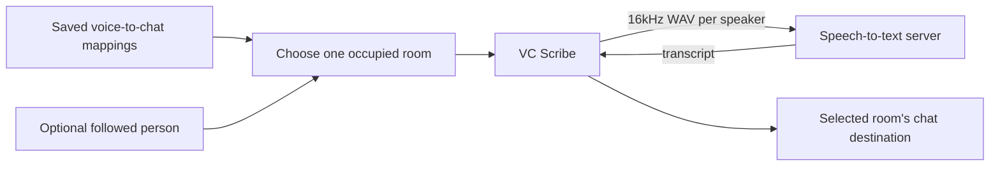

# VC Scribe

A self-hosted Discord transcription bot that watches any number of voice-to-chat mappings. One bot joins one call at a time per server, writes to that room's destination, and picks another occupied mapped room when the current call ends. Optional person-following gives one person's mapped room priority.

- **Transcripts with speakers:** each received speech segment becomes a message attributed to its speaker.
- **Flexible destinations:** map a voice or stage channel to text, announcement, thread, or voice-channel chat destinations.
- **Automatic joining:** the bot joins occupied mapped rooms when idle and leaves empty rooms.
- **Optional following:** follow one person between mapped rooms; following starts off.
- **Persistent settings:** mappings and the follow target survive restarts. Server-deafen the bot to pause transcription.

Transcript messages render mentions without pinging anyone. With a local speech-to-text server, received audio stays on your hardware after Discord delivers it to the bot.

## How it works


```mermaid
flowchart LR
    MAP[Saved voice-to-chat mappings] --> PICK[Choose one occupied room]
    FOLLOW[Optional followed person] --> PICK
    PICK --> BOT[VC Scribe]
    BOT -->|16kHz WAV per speaker| STT[Speech-to-text server]
    STT -->|transcript| BOT
    BOT --> LOG[Selected room's chat destination]
```

Discord delivers a separate audio stream per speaker. The bot decodes each stream, splits speech at pauses, and sends it to an OpenAI-compatible transcription server such as [speaches](https://github.com/speaches-ai/speaches).

### Choosing a call

The bot watches saved mappings even while disconnected from voice. When a mapped room becomes occupied and the bot is idle, it joins. If several rooms are occupied, the others wait. Only the room the bot has joined is transcribed; waiting rooms are not recorded or transcribed later.

With following off, another occupied room does not interrupt the current call. When the current room has no people left, the bot joins an occupied waiting room. If all mapped rooms are empty, it disconnects and waits.

With following on, the followed person's mapped voice channel takes priority. The bot can leave an ongoing call to join that person's mapped room. It never follows them into an unmapped room. If the person goes offline, leaves voice, or enters an unmapped room, the current call continues while other people remain. When that room becomes empty, the normal waiting-room selection resumes. Turning following off also leaves the current call running.

Each voice channel has one destination. Running `/scribe assign` again updates that mapping. Multiple voice channels can share a destination; transcript lines identify the source voice channel when they do. Joining a call posts an assignment notice in that room's destination.

## Setup

### 1. Create the Discord app

1. Open the [Discord Developer Portal](https://discord.com/developers/applications) and create an application.
2. In its **Bot** tab, disable **Public Bot** if only you should be able to invite it. Copy its bot token.
3. Invite the bot with the `bot` and `applications.commands` scopes and **View Channels**, **Connect**, and **Send Messages** permissions. No privileged intents are needed.

Replace `YOUR_APP_ID` in this invite URL:

```text
https://discord.com/api/oauth2/authorize?client_id=YOUR_APP_ID&scope=bot%20applications.commands&permissions=1051648
```

### 2. Run it

```bash
git clone https://github.com/tomerh2001/discord-vc-scribe.git
cd discord-vc-scribe
cp .env.example .env
# Set DISCORD_TOKEN in .env.
docker compose up -d --build
```

The speech-to-text server downloads its model on first use; startup time depends on the model and connection speed.

<details>
<summary>Run without Docker</summary>

Install Node.js 24 or newer, then run:

```bash
npm ci
npm run build
STT_URL=http://your-stt-server:8000 node dist/index.js
```

Set `DISCORD_TOKEN` in `.env`. Point `STT_URL` at an OpenAI-compatible `/v1/audio/transcriptions` endpoint.

</details>

### 3. Map rooms and choose optional following

| Action | Command |
|---|---|
| Watch a room and choose its transcript destination | `/scribe assign voice_channel:#General log_channel:#transcript` |
| Remove one mapping | `/scribe unassign voice_channel:#General` |
| Follow a person between mapped rooms | `/scribe follow user:@person` |
| Turn following off without interrupting the call | `/scribe unfollow` |
| See mappings, current states, and follow target | `/scribe status` |

Repeat `/scribe assign` for each voice-to-chat pair. A mapping can be saved while another mapped room is active. Server-deafen the bot to pause transcription; undeafen it to resume.

Status distinguishes **active**, **waiting** (occupied while another room is active), and **idle** (empty) mappings. It also shows connecting, paused, or error states when applicable. Following is off until an administrator explicitly enables it, and its saved setting applies only to that server.

All commands require **Manage Server**, checked when each command runs. The person selected for following must be a member of the server and cannot be a bot.

The caller must be able to view both selected channels. The bot needs **View Channel** and **Connect** in each mapped voice channel, plus **View Channel** and **Send Messages** in its destination. Threads require **Send Messages in Threads** and must be open and unlocked. Private threads also require caller and bot membership, unless they have **Manage Threads**. Channel permission overrides apply to public and private rooms alike.

Dragging the bot to another room does not create or change a mapping. Use the commands to change the rooms it watches. Disconnecting it manually does not remove a mapping; it can reconnect to an occupied mapped room.

## Configuration

Set configuration in `.env`; see [.env.example](.env.example).

| Variable | Default | Meaning |
|---|---|---|
| `DISCORD_TOKEN` | required | The bot's token |
| `STT_URL` | `http://localhost:8000` | OpenAI-compatible transcription server |
| `STT_MODEL` | `Systran/faster-whisper-small` | Transcription model |
| `STT_LANGUAGE` | auto-detect | Optional language hint, such as `en` or `he` |
| `STT_LANGUAGES` | all | Comma-separated language codes to retain |
| `STT_VAD` | off | Enable server voice-activity detection with `true`, `yes`, or `1` |
| `ALLOWED_GUILD_IDS` | allow all | Comma-separated server IDs; the bot leaves other servers |
| `SILENCE_MS` | `1200` | Pause length that ends a speech segment |
| `MIN_SPEECH_MS` | `600` | Discard shorter audio segments |
| `MAX_SEGMENT_MS` | `45000` | Split continuous speech into bounded segments |
| `DATA_DIR` | `./data` | Directory containing saved mappings and follow settings |

## Development

Node.js 24 or newer is required. Run `npm ci`, `npm run build`, and `npm test`. Tests use fake Discord clients to cover persistence, room selection, following, command permissions, and session lifecycle. CI runs these checks before publishing `ghcr.io/tomerh2001/discord-vc-scribe:latest` from `main`.

Mappings are saved in `assignments.json` and follow settings in `settings.json`, both under `DATA_DIR`. Saved state is validated on load and written by atomic replacement. A corrupt file fails startup without erasing saved settings. Do not run multiple service processes with the same token or data directory. Failed mappings remain visible in status; repair permissions and reassign the room or restart to retry.

When a room empties, the bot waits up to three seconds for its final speech to finish transcribing before moving on. Unfinished transcription work is then discarded. A message already submitted to Discord must finish sending before the move, so a slow Discord response can delay the handoff further. Deafening, destination changes, removal, and a follow-priority move discard pending audio and queued transcripts. Audio from the previous room cannot be sent to the next room's destination.

## Recording

Tell participants that the bot transcribes the call. Voice reception depends on Discord and the receiving library; only audio received while the bot is connected can be transcribed.

## License

[MIT](LICENSE)
